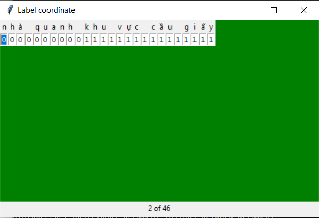

# Character Labeling Tool

# For Character-based Named Entity Recognition

## How to run

```
python label_ner_character.py
```

- Input: sentences.txt (containing sentences that you want to label)

- Output: number.txt (containing labels of characters of the number-th sentence in file ./sentences.txt) in folder ./labels

## UI


